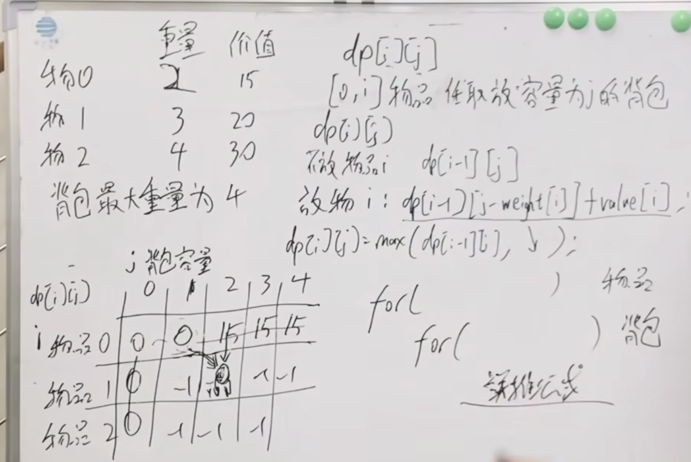

# 背包问题

* 01背包   有n种物品每种只有一个
* 完全背包 有n种物品每种有无限个
* 多重背包 有n种物品每种物品个数各不相同

[题目链接](https://kamacoder.com/problem.php?id=1046)

#### 二维dp数组

##### 动规五部曲

1. 确定用作状态转移的dp数组的下标及含义 
dp[i][j] 任取下标为[0,i]的物品 放到容量为j的背包里最大的价值

2. 动规核心 状态转移方程/递推公式
不放物品i dp[i-1][j]
放物品i   dp[i-1][j-weight[i]]+value[i]
dp[i][j] = max(dp[i-1][j], dp[i-1][j-weight[i]]+value[i])

3. dp数组如何初始化 见下图
4. 确定遍历顺序 从左上向右下遍历
5. 打印dp数组用于排错



```cpp
#include <bits/stdc++.h>

int main(){
    int n, bagweight; // n件物品，bagweight背包空间/容量
    while(std::cin >> n >> bagweight){
        std::vector<int> weight(n, 0), value(n, 0);// 每件物品空间/容量、价值
        for (int i=0;i<n;i++) std::cin >>weight[i];
        for (int j=0;j<n;j++) std::cin >>value[j];
        // dp数组, dp[i][j]代表背包空间为j的情况下,从下标为[0, i]的物品里面任意取，能达到的最大价值
        std::vector<std::vector<int>> dp(weight.size(),std::vector<int>(bagweight+1, 0));
        // 只需要把j >= weight[0]的值初始化为value[0]
        for (int j =weight[0];j<bagweight+1;j++) dp[0][j] =value[0];
        
        for (int i=1;i<n;i++) // 遍历物品
            for (int j=0; j<bagweight+1;j++)//遍历背包空间
                // 如果装不下这个物品就继承dp[i - 1][j]的值
                if (j<weight[i]) dp[i][j] =dp[i-1][j];
                // 如果能装下,就将值更新为 不装这个物品的最大值 和 装这个物品的最大值 中的 最大值，装这个物品
                // 的最大值由容量为j - weight[i]的包任意放入序号为[0, i - 1]的最大值 + 该物品的价值构成
                else dp[i][j] = std::max(dp[i-1][j], dp[i-1][j-weight[i]]+value[i]);
        std::cout<< dp[weight.size()-1][bagweight] << std::endl;
    }
}
```

#### 一维dp数组/滚动数组

##### 动规五部曲
1. 确定用作状态转移的dp数组的下标及含义
dp[j] 容量为j的背包里能装的物品的最大价值

2. 动规核心 状态转移方程/递推公式
不放物品i dp[j]   上一步直接拷贝过来
放物品i   dp[j-weight[i]]+value[i]  把重量减下去把价值加上
dp[j] = max(dp[j], dp[j-weight[i]]+value[i])

3. dp数组如何初始化 dp[0]=0  非零下标初始化成最小非负数0 防止前一个dp[i]太大而影响下一个dp[i] 掩盖掉dp[j-weight[i]]+value[i]
4. 确定遍历顺序 从左上向右下遍历
5. 打印dp数组用于排错

注意：
1. 倒序遍历 保证每个物品被添加一次，正序遍历物品会被多次添加。
相比二维dp数组，二维数组当前层由上一层推导而来，当前层和上一层互不影响，倒序正序都行。一维dp数组里数据是重复利用、不断刷新的，顺序不对当前层会受上一层数据的影响
2. 先遍历物品 再遍历背包
矩阵被压缩成数组，数据循环、滚动利用。先背包再物品 dp数组中都是一个物品的数值

```cpp
#include <bits/stdc++.h>

int main(){
    int n, bagweight; // n件物品，bagweight背包空间/容量
    while(std::cin >> n >> bagweight){
        std::vector<int> weight(n,0), value(n,0);// 每件物品空间/容量、价值
        for (int i=0;i<n;i++) std::cin >>weight[i];
        for (int j=0;j<n;j++) std::cin >>value[j];
        // dp数组, dp[j]代表背包空间为j的情况下能装物品的的最大价值
        std::vector<int> dp(bagweight+1, 0);
        
        for (int i=0;i<n;i++) // 遍历物品
            // 倒序遍历背包空间保证每个物品遍历一次 正序会遍历多次属于完全背包问题 
            // 空间从bagweight逐渐减少到当前物品所占空间 j<weight[i]指 j容量小 物品i放不进去
            for (int j=bagweight; j>=weight[i];j--)
                // 考虑放当前物品和不放当前物品的情况，选择最大值
                dp[j]= std::max(dp[j], dp[j-weight[i]]+value[i]);
        std::cout<< dp[bagweight] << std::endl;
    }
}
```